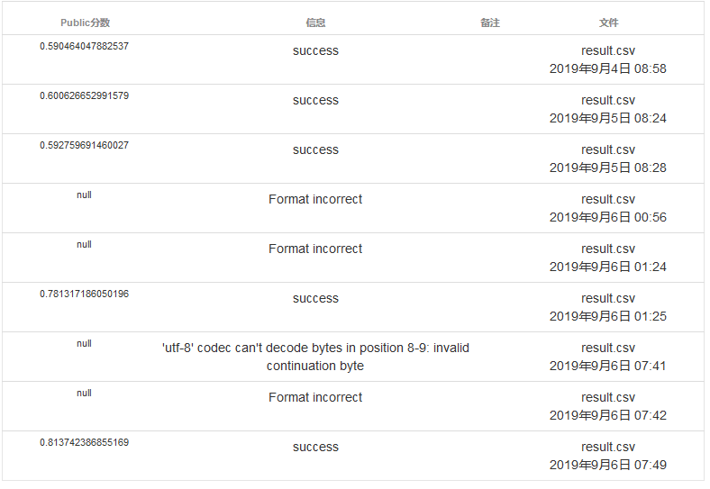

# Fake-news-detection
[智源&计算所](https://www.biendata.com/competition/falsenews/)提供的互联网虚假新闻检测挑战赛，为其中赛道一：给定一个新闻事件的文本，判定该事件属于真实新闻还是虚假新闻。

1. test.py
   使用了jieba分词 + gensim 模型，用TF-IDF模型进行预测。
2. solution.py
   用sklearn提供的CountVectorizer、TfidfVectorizer进行

